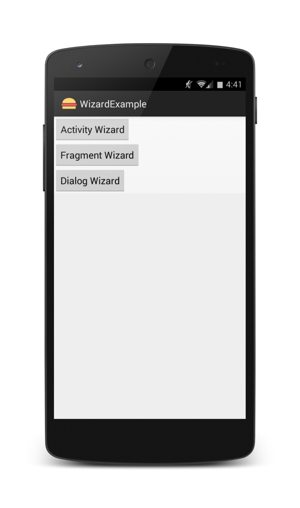
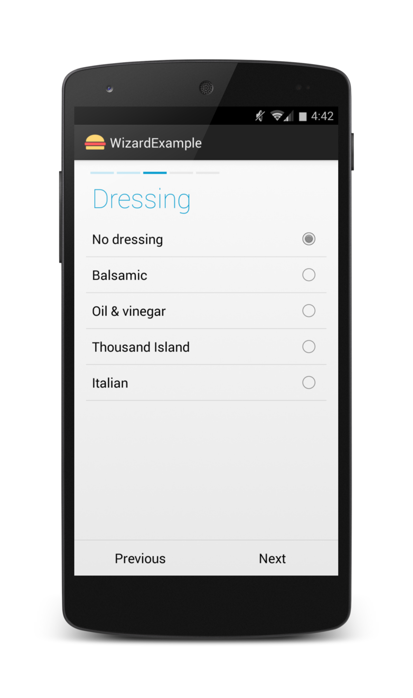
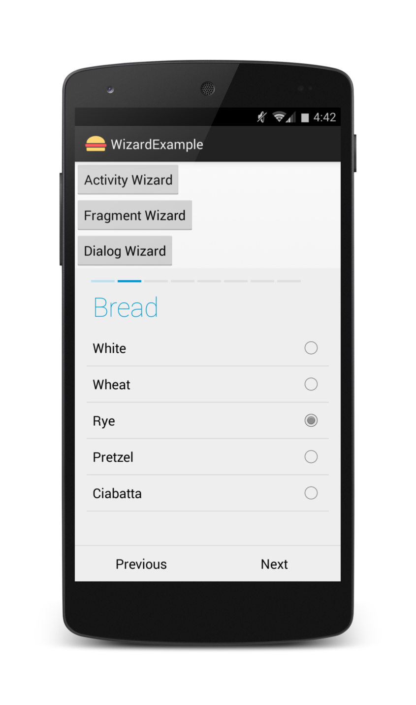
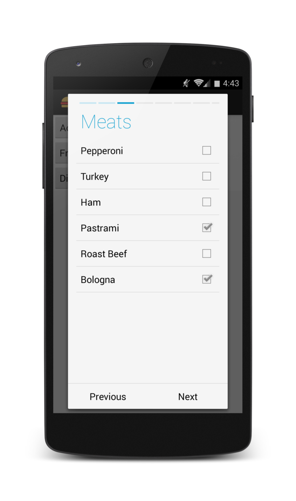

Android WizardPager
===================

This repo is a fork of Roman Nurik's [Android-WizardPager](https://github.com/romannurik/Android-WizardPager), improving upon it in many ways.

Screen Shots
------------






Changes
-------
* Made it easier to use in other projects by moving methods into the library from the example (inspired by pflammertsma's [work](https://github.com/pflammertsma/Android-WizardPager))
* Moved the example into its own project, improved upon it
* Lowered the minimum API to 8 (Android Froyo) by rearranging some themes. Could possibly go even lower
* Added a Fragment class
* Added a DialogFragment class


Usage
-----

Start by making a class that extends WizardActivity, WizardFragment or WizardDialogFragment depending on your needs. We're going to make a WizardActivity.

```java
public class ActivityExample extends WizardActivity {

	@Override
	public void onCreate(Bundle savedInstanceState) {
		super.onCreate(savedInstanceState);
	}
}
    
```

In the onCreate (or onCreateView for WizardFragment), set the view to be R.layout.wizard (feel free to modify the appearance of this file from the library).

```java
	//Set layout of Pager
	@Override
	public void onCreate(Bundle savedInstanceState) {
		super.onCreate(savedInstanceState);
		setContentView(R.layout.wizard);

		ViewPager mPager = (ViewPager) findViewById(R.id.pager);
		StepPagerStrip mStepPagerStrip = (StepPagerStrip) findViewById(R.id.strip);
		Button mNextButton = (Button) findViewById(R.id.next_button);
		Button mPrevButton = (Button) findViewById(R.id.prev_button);
		setControls(mPager, mStepPagerStrip, mNextButton, mPrevButton);
	}

```

Implement the necessary methods needed for WizardActivity, WizardFragment, or WizardDialogFragment. We need onCreateModel, onSubmit, and useBackForPrevious.

```java
	//Create Wizard
	@Override
	public AbstractWizardModel onCreateModel() {
		return new SandwichWizardModel(this);
	}
```

```java
	//Method that runs after wizard is finished
	@Override
	public void onSubmit() {
		DialogFragment dialog = new DialogFragment() {

			@Override
			public Dialog onCreateDialog(Bundle savedInstanceState) {
				return new AlertDialog.Builder(getActivity())
                        .setTitle(R.string.submit_confirm_title)
						.setMessage(R.string.submit_confirm_message)
						.setPositiveButton(R.string.submit_confirm_button, null)
						.setNegativeButton(android.R.string.cancel, null)
						.create();
			}
		};
		dialog.show(getSupportFragmentManager(), "place_order_dialog");
	}
```

```java	
	//Allow back button to be used to go back a step in the wizard
 	@Override
    	public boolean useBackForPrevious() {
        	return true;
    	}
```

In this example, the class SandwichWizardModel creates the wizard. This class just needs a contructor passing the context and onNewRootPageList creating the wizard.

```java
public class SandwichWizardModel extends AbstractWizardModel {
    public SandwichWizardModel(Context context) {
        super(context);
    }

    @Override
    protected PageList onNewRootPageList() {
        return new PageList(
                new BranchPage(this, "Order type")
                        .addBranch("Sandwich",
                                new SingleFixedChoicePage(this, "Bread")
                                        .setChoices("White", "Wheat", "Rye", "Pretzel", "Ciabatta")
                                        .setRequired(true),

                                new MultipleFixedChoicePage(this, "Meats")
                                        .setChoices("Pepperoni", "Turkey", "Ham", "Pastrami",
                                                "Roast Beef", "Bologna"),

                                new MultipleFixedChoicePage(this, "Veggies")
                                        .setChoices("Tomatoes", "Lettuce", "Onions", "Pickles",
                                                "Cucumbers", "Peppers"),

                                new MultipleFixedChoicePage(this, "Cheeses")
                                        .setChoices("Swiss", "American", "Pepperjack", "Muenster",
                                                "Provolone", "White American", "Cheddar", "Bleu"),

                                new BranchPage(this, "Toasted?")
                                        .addBranch("Yes",
                                                new SingleFixedChoicePage(this, "Toast time")
                                                        .setChoices("30 seconds", "1 minute",
                                                                "2 minutes"))
                                        .addBranch("No")
                                        .setValue("No"))

                        .addBranch("Salad",
                                new SingleFixedChoicePage(this, "Salad type")
                                        .setChoices("Greek", "Caesar")
                                        .setRequired(true),

                                new SingleFixedChoicePage(this, "Dressing")
                                        .setChoices("No dressing", "Balsamic", "Oil & vinegar",
                                                "Thousand Island", "Italian")
                                        .setValue("No dressing")
                        )

                        .setRequired(true),

                new CustomerInfoPage(this, "Your info")
                        .setRequired(true)
        );
    }
}
```

Original ReadMe
---------------

Example `ViewPager`-based wizard UI sample code. See [my Google+ post](https://plus.google.com/+RomanNurik/posts/6cVymZvn3f4) for more details.


Additional page type examples (boolean and single text field) can be found in <a href="https://github.com/str4d/android-wizardpager/tree/textfield">str4d's fork</a> (<a href="https://github.com/str4d/android-wizardpager/tree/textfield/src/com/example/android/wizardpager/wizard/model">`model`</a>, <a href="https://github.com/str4d/android-wizardpager/tree/textfield/src/com/example/android/wizardpager/wizard/ui">`ui`</a>).
